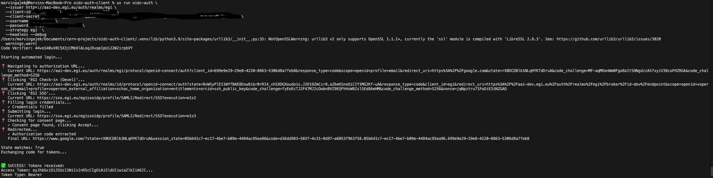

# oidc-auth-client

Automated OIDC authentication client with PKCE support for any Keycloak or OAuth2 provider.

## Features

- 🔐 **PKCE (Proof Key for Code Exchange)** - Secure authorization code flow
- 🤖 **Automated browser login** - No manual intervention needed
- 🔌 **Provider agnostic** - Works with any OIDC/OAuth2 provider
- 🎯 **Pluggable strategies** - Simple forms, EGI, or custom authentication flows
- 🐍 **Simple API** - Easy integration in Python scripts

## Prerequisites

Install [uv package manager](https://docs.astral.sh/uv/getting-started/installation/), e.g. Standalone installer for `macOS` or `Linux`:

```bash
curl -LsSf https://astral.sh/uv/install.sh | sh
source $HOME/.local/bin/env
```

## Setup

```bash
uv sync
uv run playwright install chromium
```

## Usage

### CLI

**Simple form (default)**
```bash
uv run oidc-auth \
  --issuer https://keycloak.example.com/auth/realms/realm \
  --client-id YOUR_CLIENT_ID \
  --client-secret YOUR_SECRET \
  --username user@example.com \
  --password yourpassword \
  --headless
```

**EGI Check-in**
```bash
uv run oidc-auth \
  --issuer https://aai-dev.egi.eu/auth/realms/egi \
  --client-id YOUR_CLIENT_ID \
  --client-secret YOUR_SECRET \
  --username user@cern.ch \
  --password yourpassword \
  --strategy egi \
  --headless
```

**Run modes**
```bash
# Normal mode (headless browser)
uv run oidc-auth --headless ...

# Debug mode (headless browser with screenshots and verbose logging)
uv run oidc-auth --debug --headless ...

# Debug mode without headless (visible browser with screenshots and verbose logging)
uv run oidc-auth --debug ...
```

**Results resemble**



### Python API

**Simple form**
```python
from oidc_auth_client import OIDCAuthClient

client = OIDCAuthClient(
    issuer_url="https://keycloak.example.com/auth/realms/realm",
    client_id="client-id",
    client_secret="secret",
    username="user@example.com",
    password="password",
)

tokens = client.get_tokens()
print(tokens['access_token'])
```

**EGI Check-in**
```python
from oidc_auth_client import OIDCAuthClient
from oidc_auth_client.strategies import EGIStrategy

client = OIDCAuthClient(
    issuer_url="https://aai-dev.egi.eu/auth/realms/egi",
    client_id="your-client-id",
    client_secret="your-secret",
    username="user@cern.ch",
    password="password",
    auth_strategy=EGIStrategy(),
)

tokens = client.get_tokens()
```

**Custom strategy**
```python
from oidc_auth_client.strategies import AuthStrategy

class CustomStrategy(AuthStrategy):
    def login(self, page, username, password):
        page.fill('#custom-user', username)
        page.fill('#custom-pass', password)
        page.click('#custom-submit')

client = OIDCAuthClient(..., auth_strategy=CustomStrategy())
```

## How It Works

1. **Generates PKCE** code verifier and challenge (SHA-256)
2. **Creates authorization URL** with PKCE parameters
3. **Automates browser login** via Playwright using selected strategy
4. **Exchanges authorization code** for tokens using code verifier
5. **Returns tokens** (access_token, id_token, refresh_token)

## Supported Strategies

- **simple** - Basic username/password form (default)
- **egi** - EGI Check-in multi-step authentication
- **custom** - Implement your own `AuthStrategy`

## License

MIT
